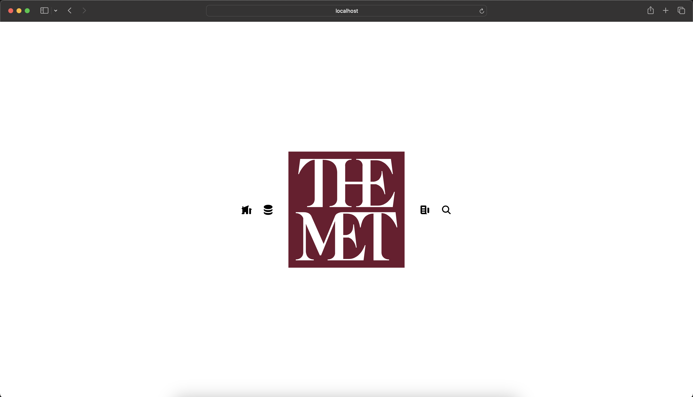

# The Metropolitan Museum of Art API Client
Implementation of a web client for the MET API using Next.js framework.
Uses client side rendering for accessing API data.
Thanks to the MET for allowing for public use of the API, more information available [here](https://metmuseum.github.io/).


## To Run

First, install npm packages:

```bash
npm i
```

Then run development server:

```bash
npm run dev
```

Open [http://localhost:3000](http://localhost:3000) with your browser to see the result.

<!--  -->